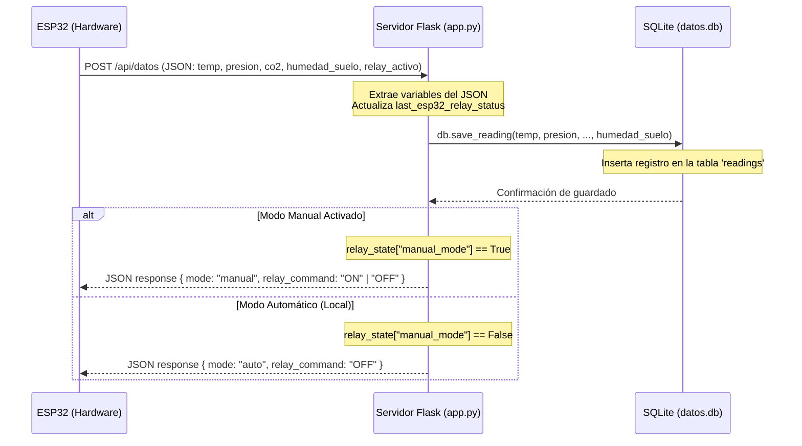
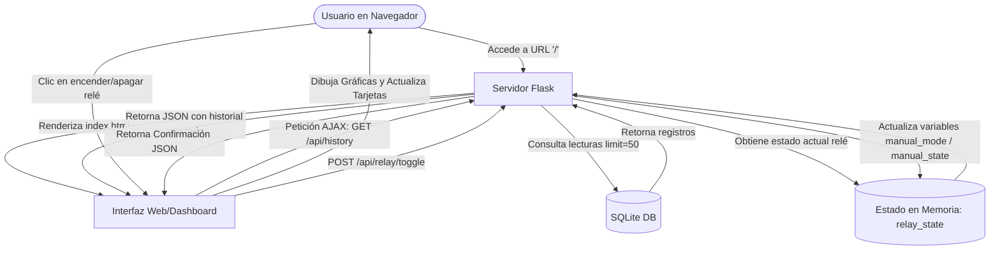
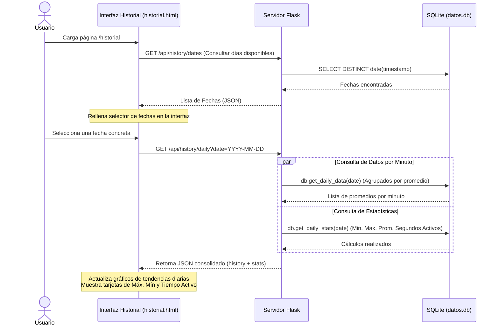

# Documentación del Servicio Web en Flask (Backend)

Esta documentación describe detalladamente la arquitectura, tecnologías, código de backend y el flujo de datos del servidor web Flask, desarrollado para recibir y visualizar las lecturas del ESP32. El servicio se compone de los archivos [app.py](file:///c:/Users/Usuario/Documents/python/proyectotecnologia/proyectoiot/app.py) (lógica web y rutas) y [datos.py](file:///c:/Users/Usuario/Documents/python/proyectotecnologia/proyectoiot/datos.py) (gestión de la base de datos).

---

## 1. Tecnologías y Herramientas Utilizadas

### 🐍 Python
Es un lenguaje de programación interpretado de alto nivel, conocido por su sintaxis clara, legibilidad y versatilidad. En este proyecto, sirve como el lenguaje de desarrollo backend, permitiendo manipular los datos de forma rápida, conectarse a bases de datos SQLite y estructurar las respuestas JSON que consume el ESP32 y el Dashboard.

### 🌶️ Flask (v3.0.2)
Es un microframework para Python. Se le denomina "micro" porque no requiere herramientas ni librerías particulares, manteniendo el núcleo simple pero altamente extensible.
* **Funciones Clave en el Proyecto:**
  * **Enrutamiento (Routing):** Define las URLs o puntos finales (endpoints) que tanto el ESP32 como los navegadores web pueden visitar (ej. `/api/datos`, `/api/history`, etc.).
  * **Manejo de Peticiones y Respuestas:** Procesa datos JSON entrantes de peticiones `POST` a través del objeto `request`, y genera respuestas JSON estructuradas con `jsonify`.
  * **Renderizado de Plantillas (Jinja2):** Sirve las interfaces de usuario (HTML) inyectando datos dinámicos mediante `render_template`.

### 🗄️ SQLite3 (Módulo `sqlite3`)
Es un motor de base de datos relacional SQL autónomo, sin servidor y sin configuración previa. 
* **Ventajas en este proyecto:**
  * Todo el almacenamiento se guarda en un solo archivo físico local llamado `datos.db`.
  * Se gestiona directamente a través de la librería estándar de Python (`sqlite3`), eliminando la necesidad de levantar un servicio de base de datos externo (como MySQL o PostgreSQL).
  * Guarda datos históricos de temperatura, presión, altitud, estado del relé, calidad de aire ($CO_2$ y humo) y humedad del suelo, incluyendo una marca de tiempo generada automáticamente en hora local.

### 🦄 Gunicorn (Green Unicorn v21.2.0)
Es un servidor HTTP WSGI (Web Server Gateway Interface) para Python y sistemas UNIX. 
* **¿Por qué se usa?** El servidor de desarrollo integrado de Flask (`app.run()`) no es seguro ni eficiente para producción. Gunicorn permite manejar múltiples peticiones simultáneas utilizando procesos de ejecución en paralelo (*workers*). Es el estándar para desplegar aplicaciones Flask en la nube.

---

## 2. Despliegue en la Nube: Render

La aplicación está configurada para ser desplegada en **Render**, una plataforma de nube moderna y fácil de usar para alojar aplicaciones web.

### ⚙️ Configuración del Despliegue en Render
Cuando se crea un "Web Service" en Render, se definen los siguientes parámetros de despliegue:
1. **Entorno de Ejecución (Runtime):** Python.
2. **Comando de Construcción (Build Command):** 
   ```bash
   pip install -r requirements.txt
   ```
   *Instala Flask y Gunicorn definidos en el archivo [requirements.txt](file:///c:/Users/Usuario/Documents/python/proyectotecnologia/proyectoiot/requirements.txt).*
3. **Comando de Inicio (Start Command):**
   ```bash
   gunicorn app:app
   ```
   *Le indica a Gunicorn que arranque el servidor usando la variable global `app` definida en el archivo `app.py`.*

> [!CAUTION]
> **Persistencia de la Base de Datos en Render:**
> En los planes gratuitos de Render, el sistema de archivos del contenedor es **efímero** (temporal). Esto significa que el archivo `datos.db` de SQLite se reiniciará/borrará cada vez que el servicio se apague por inactividad, se vuelva a compilar o se reinicie. Para evitar esto en producción, se requiere:
> * Usar un volumen de almacenamiento persistente montado en Render y apuntar el archivo de base de datos a esa ruta.
> * O conectar la aplicación Flask a una base de datos externa administrada (como PostgreSQL de Render).

---

## 3. Endpoints del API (Rutas del Servidor)

| Método HTTP | Endpoint | Descripción | Consumidor principal |
| :--- | :--- | :--- | :--- |
| **GET** | `/` | Retorna la página del panel de control (`index.html`). | Usuario final (Navegador) |
| **GET** | `/historial` | Retorna la interfaz de logs históricos (`historial.html`). | Usuario final (Navegador) |
| **POST** | `/api/datos` | Recibe JSON del ESP32, lo guarda en BD y retorna órdenes para el relé. | Microcontrolador ESP32 |
| **GET** | `/api/history` | Retorna las últimas 50 lecturas guardadas y el estado actual del relé. | Gráficas del Dashboard |
| **POST** | `/api/relay/toggle` | Cambia el estado del relé a Manual y alterna entre ON/OFF. | Dashboard (Botones UI) |
| **GET** | `/api/history/dates` | Retorna un listado de las fechas únicas con registros en la BD. | Calendario en Historial |
| **GET** | `/api/history/daily` | Retorna el promedio por minuto y estadísticas de un día específico. | Gráfica de Historial Diario |

---

## 4. Diagramas de Flujo del Servicio

### 🔄 Flujo 1: Recepción de Datos del ESP32 (`POST /api/datos`)
Describe cómo interactúan el ESP32, el Servidor Flask y la Base de Datos cuando se envían las lecturas de los sensores.



---

### 📊 Flujo 2: Interacción del Usuario en el Dashboard (`/`)
Muestra cómo la interfaz web del usuario consulta y actualiza los estados en tiempo real.



---

### 📈 Flujo 3: Consulta en el Historial (`/historial`)
Muestra cómo funciona la consulta histórica diaria con agregación de datos por minuto y cálculo de estadísticas.


